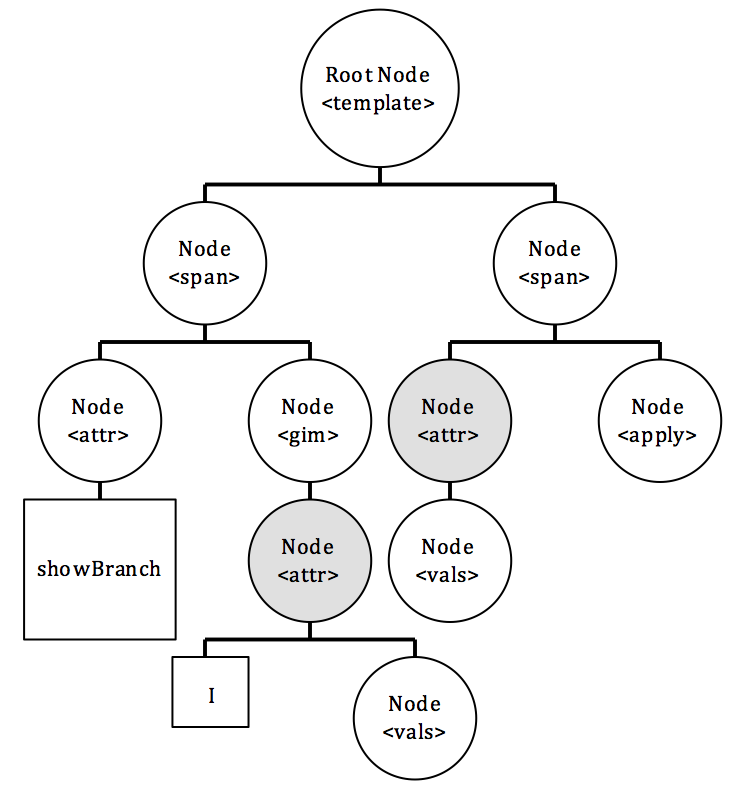

<!-- Don't edit in between this line and the one below -->
```{r include=FALSE}
# Don't delete this chunk if you are using the DataComputing package
library(DataComputing)
library(printr)
```
*Source file* 
```{r, results='asis', echo=FALSE}
includeSourceDocuments("/Users/felixsu/ucb_classes/Sp16/STAT133/labs/lab13/Lab-13-Su.Rmd")
```
<!-- Don't edit the material above this line -->

####6. Sketch a tree for the XML. What does `xpathSApply(Tree, ‘//attr[@name = "id"]’, xmlValue)` return?
**ANS:**



```{r eval=FALSE}
## xpathSApply(Tree, ‘//attr[@name = "id"]’, xmlValue) returns a vector containing the contents of all the nodes named "attr", with attribute name="id":
[1] "showBranch" "I"
```

####7. What does it mean for XML to be well-formed?
**ANS:**

1. Tag names are case-sensitive; start and end tags must match exactly.
2. No spaces are allowed between the < and the tag name.
3. Tag names must begin with a letter and contain only alphanumeric characters.
4. An element must have both an open and closing tag unless it is empty.
5. An empty element that does not have a closing tag must be on of the following forms
```
<tagname/>
<element></element>
<element />
```
6. Tags must nest properly. (Inner tags must close before outer ones.)
```
<root>
  <child>
    <subchild>.....</subchild>
  </child>
</root>
```
7. All attributes must appear in quotes in a name = “value” format
```<person gender='female'>```
8. There are 5 pre-defined entity references in XML:
```
&lt;    <   less than
&gt;    >   greater than
&amp;   &   ampersand 
&apos;  '   apostrophe
&quot;  "   quotation mark
```
9. All XML documents must contain a root node (doesn’t need to be called root) containing all the other nodes.
10. (Optional) The line: `<?xml version="1.0" encoding="UTF-8”?>`

####8. Which of the following represents an absolute path? (Select all that apply) 
**ANS: d** 

a) ../home/file.txt 
b) bin/cat
c) cs2204/
d) **/usr/bin/cat**

####12. Explain what each Regex means:
**ANS:**

* ?   (question mark): `match preceeding item zero or one time`
* {}  (curly brackets): `Bounds the number of times for the preceeding item to match.`
* .   (period): `match any character`

####13. Which of the following Regex patterns find only strings that begin with a number?
**ANS: c**

a) `"[^0-9]"`
b) `"^[#]"`
c) **`"^[0-9]"`**
d) `"[[:digit]]+"`

####14. Below is a table of patterns and character strings. Determine if the pattern is found int he character string or not. If it is found, provide the starting point and ending point of the match. If no match found write NULL
```{r, echo=FALSE}
patt <- 
  c('"abc"',
    '"a[bd]+"',
    '"cat"',
    '"cat$"',
    '"th.*"')
char <- 
  c('"abcdefg"',
    '"The abd"',
    '"Where is the cat?"',
    '"Where is the cat?"',
    '"Hello there friend"')
found <-
  c('Y',
    'Y',
    'Y',
    'N',
    'Y')
start <-
  c('1',
    '5',
    '14',
    'NULL',
    '7')
end <- 
  c('3',
    '7',
    '16',
    'NULL',
    '8')
patt_table <- data.frame(patt, char, found, start, end)
names(patt_table) <- c("Pattern", "Character String", "Found? (Y/N)", "Start Index", "End Index")
patt_table
```

####3.

a) Show all the files in the current directory that have "stat" in their name.
    
    **ANS:** `ls | grep 'stat'`
    
b) Write the results from a) to a file called “statfiles.txt”.
    
    **ANS:** `ls | grep 'stat' > statfiles.txt`
    
####3. The following XML is not well-formed. Circle each error and explain which rule is not being met.
**ANS:**

* **Error 1: All XML documents must contain a root node containing all the other nodes**
* **Error 2: All attributes must appear in quotes in a name = "value" format**
* **Error 3: Tags must nest properly. (Inner tags must close before outer ones.)**
```
# Error 1
<catalog>
<plant>
<price>$2.79</price>
<zone>3</zone>
<NAME>Azaela</NAME>
</plant>
<plant>
<price type=discount>$1.49</price> # Error 2
<zone></zone>
<name>Geranium</name>
</plant>
</catalog>
<catalog>
<plant>
<price>$1.99 <zone>4 </price> # Error 3
</zone>
<Name>Camelia</Name>
</plant>
</catalog>
```

####8. Using the Tree in the problem, for each of the following Path expressions, provide the numbers of the nodes which are located by the expression:
**ANS:**

a) `a/b/`: **2**
b) `//f`: **4, 9**
c) `//b/..`: **1, 3**
d) `//c//f`: **9**

####7. Using the tables given and your favorite dplyr commands such as `select()`, `mutate()`, `filter()`, `inner_join()`, `group_by()`, `summarise()`, etc. provide R code to find the following.
**ANS:**

a) The secure ID and department of all employees earning less than $35,000.
```{r, eval=FALSE}
Payroll_sqlite %>%
  filter(Salary < 35000) %>%
  select(SID, Dept)
```

b) The public ID and number of vehicles registered with any employee who has a vehicle registered with the parking office
```{r, eval=FALSE}
Vehicle_sqlite %>%
  group_by(UID) %>%
  summarise(n = n())
```

c) The name and address of all employees who have a vehicle registered with the parking office.
```{r, eval=FALSE}
Employee_sqlite %>%
  left_join(Vehicle_sqlite) %>%
  select(Name, Address)
```